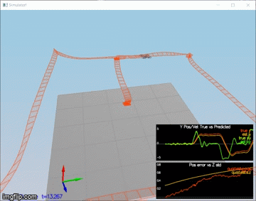

## Flying Car Engineer Nanodegree - Project 4: Estimation

In this write-up I will describe how I addressed each of the steps outlined in the [project README.](https://github.com/udacity/FCND-Estimation-CPP#the-tasks "project README")

Throughout this document I will be referencing the provided [Estimation for Quadrotors](https://www.overleaf.com/project/5c34caab7ecefc04087273b9 "Estimation for Quadrotors") as __EfQ__.

#### 1: Sensor Noise
I run scenario #6 in the simulator, which generates some sensor data from a static quad, in particular the GPS and accelerometer x measurements. The sensor data were saved in 2 txt files which I then processed (using a Jupyter notebooks and Pandas) and figured out the standard deviation of the two measured signals as follows:
- std(Quad.GPS.X) = 0.709497
- std(Quad.IMU.AX) = 0.496512

Finally, I plugged these values in `config/6_Sensornoise.txt` and run the simulator and run the simulator again. This time, around 68% of the measurements fall within the +/- 1 standard deviation range, as expected for a Gaussian noise model).

__Simulator Scenario #6__

#### 2: Attitude Estimation
I modified the function `UpdateFromIMU()` in `QuadEstimatorEKF.cpp`. In particular, I implemented  a better integration rate gyro attitude scheme by following EfQ section 7.1.2 and the instructions in the provided code hints about the Quaternion<float> class.

As a result, the attitude errors were limited within 0.1 rad for each Euler angle.

__Simulator Scenario #7__

#### 3: Prediction Step

###### Part 1
I implemented the state prediction step in the `PredictState()` functon in `QuadEstimatorEKF.cpp`, as per EfQ equation (49). Now in simulator scenario 08_PredictState the estimated state reasonably tracks the actual state.

__Simulator Scenario #8__

###### Part 2
I calculated the partial derivative of the body-to-global rotation matrix in the function `GetRbgPrime()` in `QuadEstimatorEKF.cpp`, as per EfQ equation (52). Then, I implemented the covariance predictin step in `Predict()`, as per line 4 of EfQ Algorithm (2), also using EfQ equation (51). Finally, I tuned `QPosXYStd` and `QVelXYStd`  parameters in `QuadEstimatorEKF.txt` so as to capture the magnitude of the error in simulation scenario 09_PredictionCov. 

Eventually, in in simulation scenario 09_PredictionCov our covariance (the white line) grows reasonably like the data and the charts resemble the provided examples of a 'good' solution.

__Simulator Scenario #9__

#### 4: Magnetometer Update
I implement the function `UpdateFromMag()` as per EfQ equations (56) and (58) and tuned the parameter `QYawStd`. As a result, my estimator met the success criteria for smulation scenario 10_MagUpdate.

__Simulator Scenario #10__

#### 5: Closed Loop + GPS Update
I switched to using my estimator and a realistic IMU by setting `Quad.UseIdealEstimator = 0` in `11_GPSUpdate.txt` and commenting out the rrelevant lines in `11_GPSUpdate.txt`. Then I implemented the function `UpdateFromGPS()` as per EqF equations (53) and (55) and tuned the GPS measurement std deviations in `QuadEstimatorEKF.txt`. As a result, my estimator met the success criteria for simulation scenario 11_GPSUpdate

__Simulator Scenario #11 - Provided controller__

#### 6: Adding Your Controller
I replaced the provided controller and associated control parameters with the controller I developed for project 3 and its own control parameters. I tried running scenario 11 again but the drone crashed. Then I re-tuned my controller's parameters, starting with the body rates. Finally, my controller - estimator combo  was able to meet the success criteria for scenario 11, even though the trajectory looks a bit ugly :)

__Simulator Scenario #11 - My controller from Project 3__

